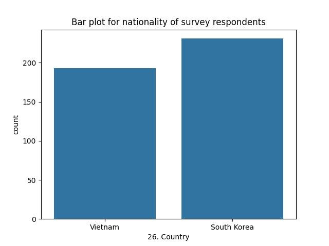
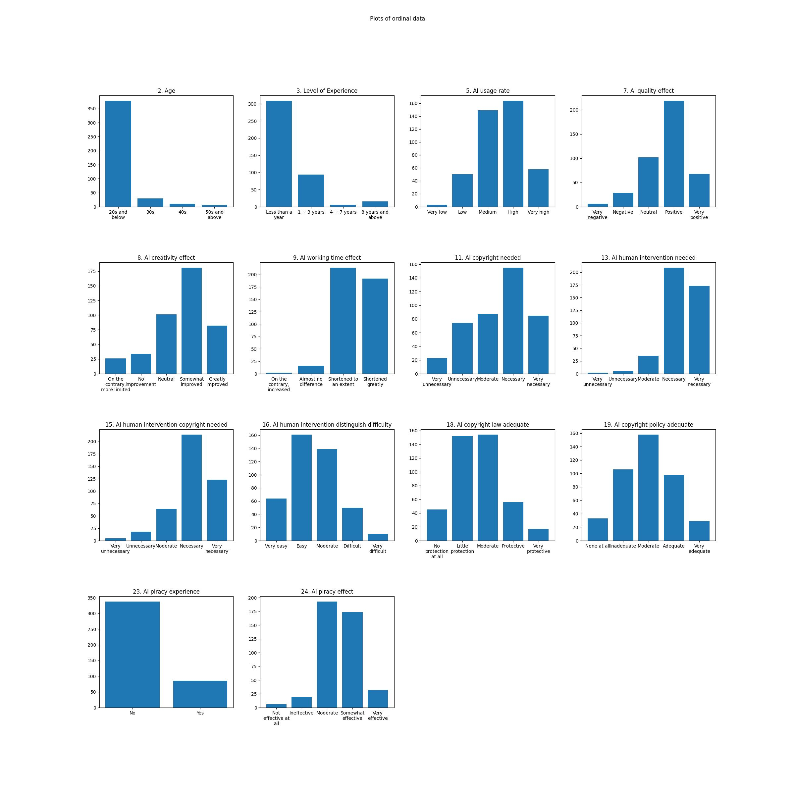
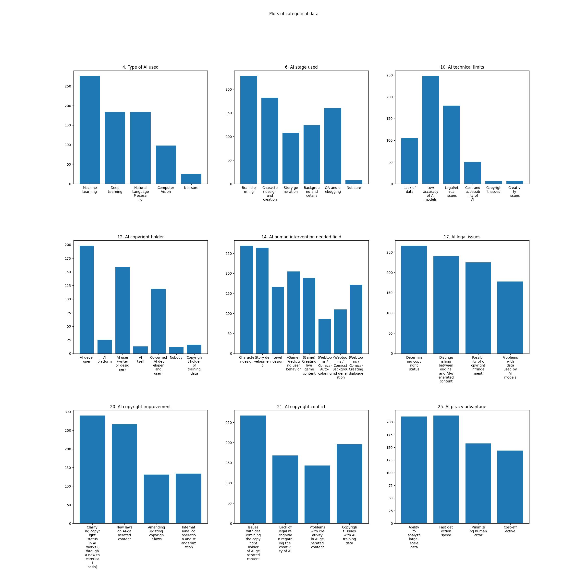
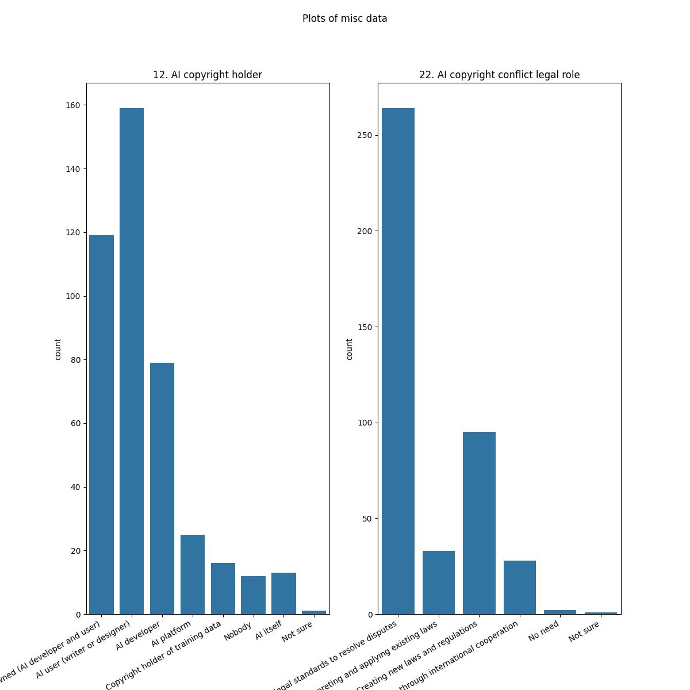
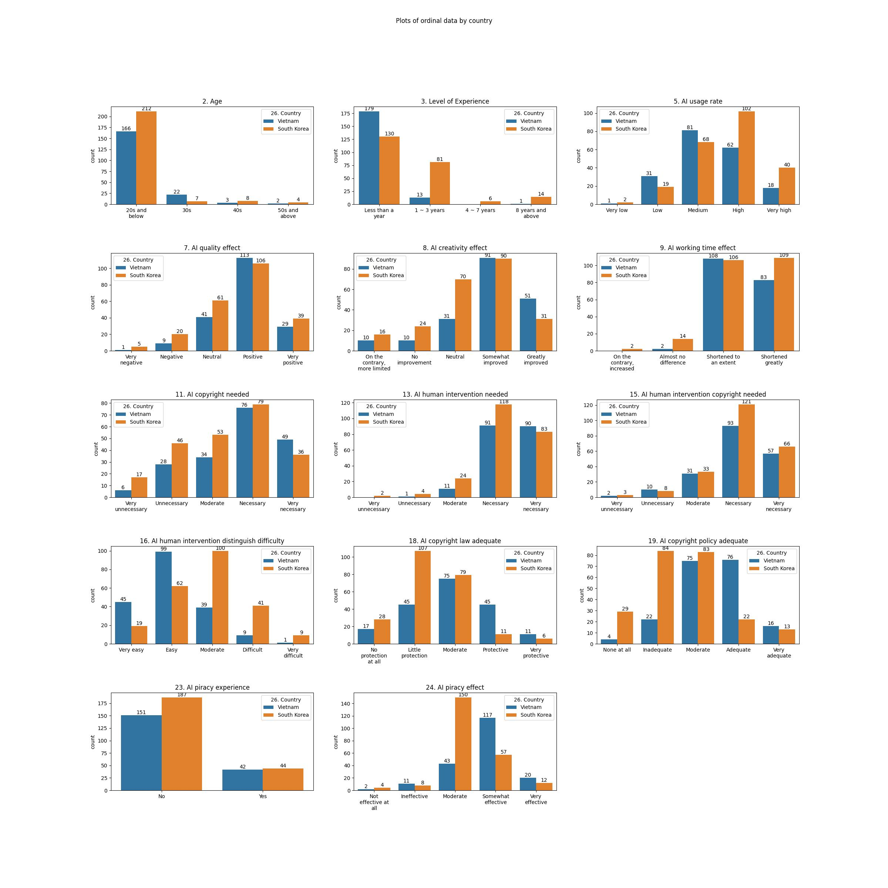
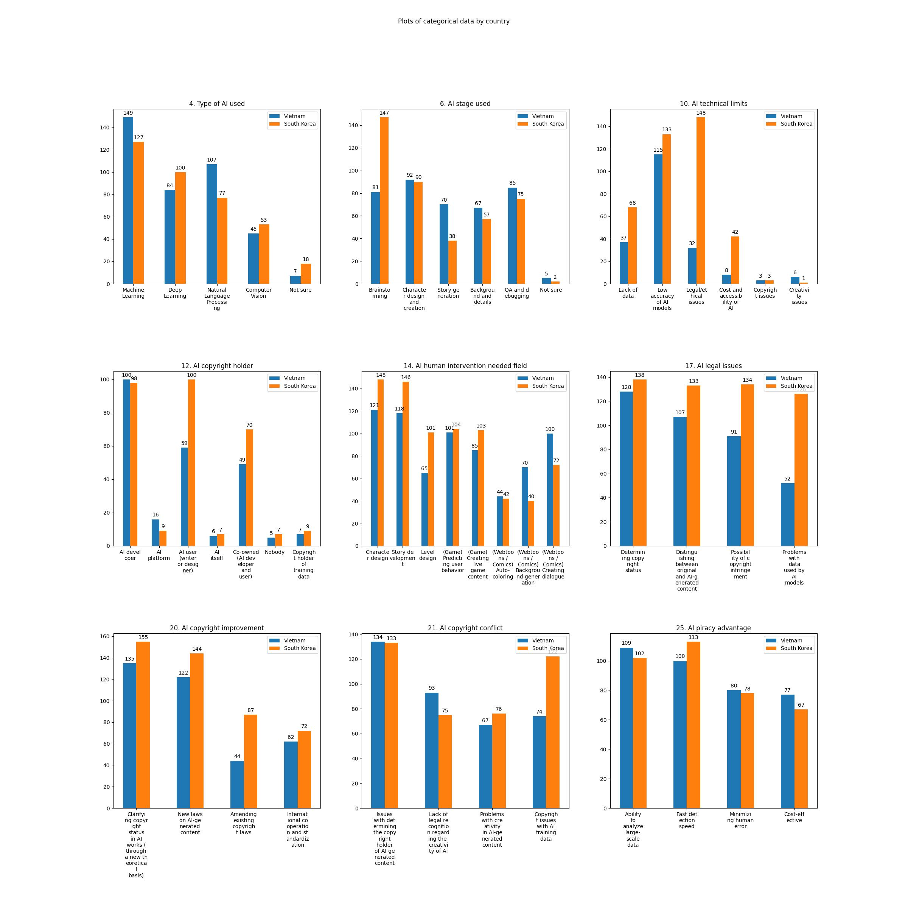
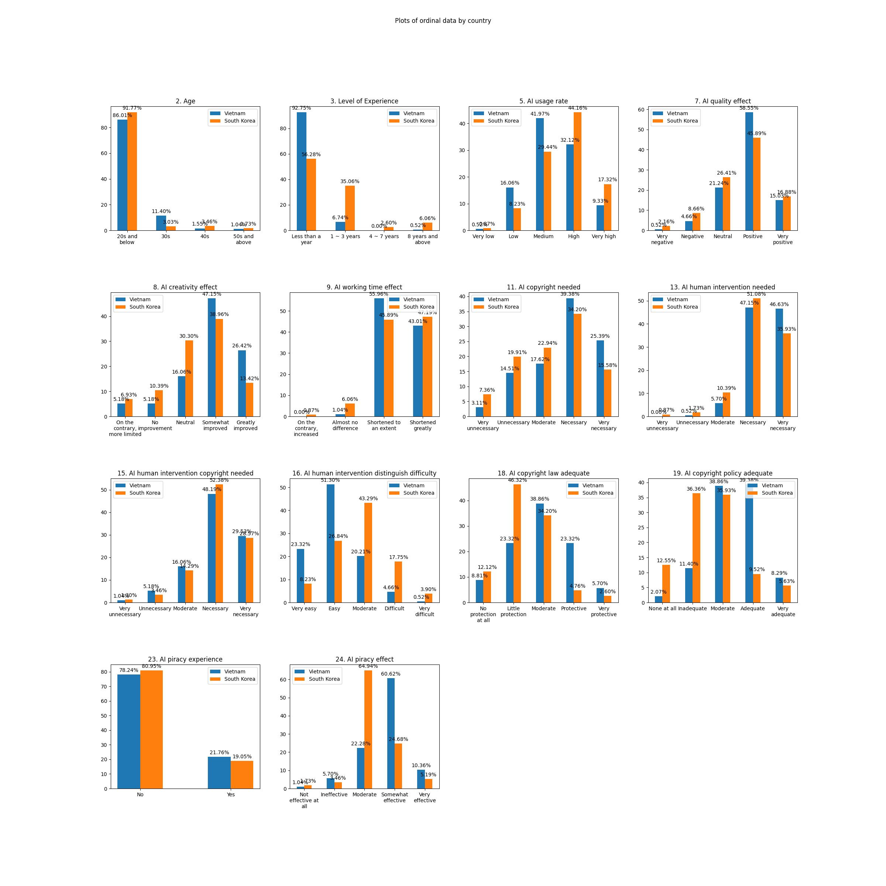
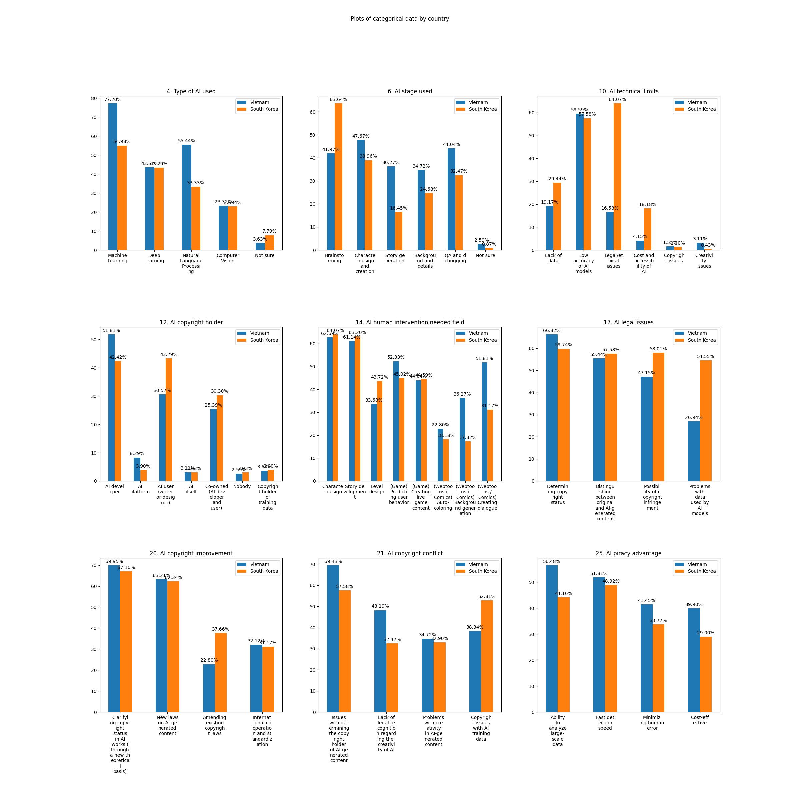
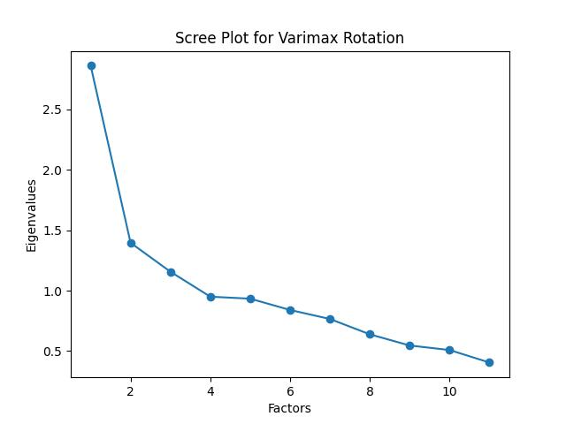

# Differences in AI perception between South Korea and Vietnam

## Overview

This is a project on the differences in perception of AI between South Korea and Vietnam, based on a survey conducted on over 400 college students and industry professionals who are working in game development and various related fields. The project is being done in collaboration with [GCT Lab](https://gctlab-hongik.ac.kr/), a lab affiliated with the [School of Games](https://www.husg.net/) at [Hongik University](https://www.hongik.ac.kr) in South Korea. The repository contains the code used for analysis and visualization, along with the original survey data (modified only to remove identifying personal information of the participants). The ReadME only goes over the data cleaning and analaysis process very briefly - more details are explained in the Jupyter Notebook containing the code. If you have any questions about the data or the code please feel free to contact me at jameskoh2710-at-gmail.

## Notes

 - The survey was designed and conducted before my involvement in the project

## Process

### Data Cleaning

I first eliminated the participants' personal information (e-mail addresses and such) that could potentially identify them as I was planning on uploading both the dataset and the code to a public repo. I then translated the survey answers from the original Korean/Vietnamese into English, and added a country column as the original survey did not ask for the participants' country. A lot of the questions were open-ended, so I also had to translate and classify many of the responses.

### Visualization

I classified the survey data into ordinal, categorical, and miscellaneous data. The columns in the miscellaneous data were: 1. Occupation (this column was ultimately not used due to difficulties in precisely determining many of the answers as well as a lack of variability in the data), 12. The rightful copyright holder of AI-generated content, 22. The role of the legal system in regulating AI-content, and 26. Country. The last was excluded for convenience from categorical data as the survey was mainly conducted to research the differences in perception of AI between South Korea and Vietnam, so it seemed practical to separate it from other categorical data.

I then generated graphs for both ordinal and categorical data, by both total count and proportion of respondents, and by both combining both countries' data and separating by country, to produce a total of six graphs for easy visualization. I also produced a simple barplot for the nationality of the respondents, as well as a plot for the two questions classified as miscellaneous data. It is worth noting that many of the categorical questions had multiple answers enabled (ie the respondents could select more than one answer), so both the absolute numbers and the percentages add up to more than the total and 100% respectively. The graphs are reproduced here:

### Exploratory Analysis

I first performed naive statistical tests, appropriate to each type of IV (Independent Variable) and DV (Dependent Variable), to test the hypotheses formed before the survey was conducted. I found several statistical relationships that encouraged me to delve more deeply into the data.

### Factor Analysis

I also performed factor analysis to uncover latent factors behind the survey answers. Before doing so I performed Bartlett's test of sphericity on the correlation matrix gleaned from the data, as well as the Kaiser-Meyer-Olkin (KMO) test to see whether the data is appropriate for factor analysis, before proceeding. After the initial KMO test, I eliminated columns with low KMO scores (thus the partial correlations are large compared to the total correlations) and ran the KMO test again.

I hypothesized that an oblique rotation would be appropriate given the nature of the data, although it turned out that the results differed very little whether the rotation was promax (a type of oblique rotation) or varimax (a type of orthogonal rotation). I created scree plots, as well as calculated the eigenvalues, for both types of rotations which confirmed that the appropriate number of factors to test for was 3.

After performing the factor analysis, I hypothesized that the three factors were:

1. The adequacy of protection for AI-generated content in the respective countries
2. The impact AI has on the work of the participants
3. The participants' perception on the necessity of copyright protection for AI-generated content

